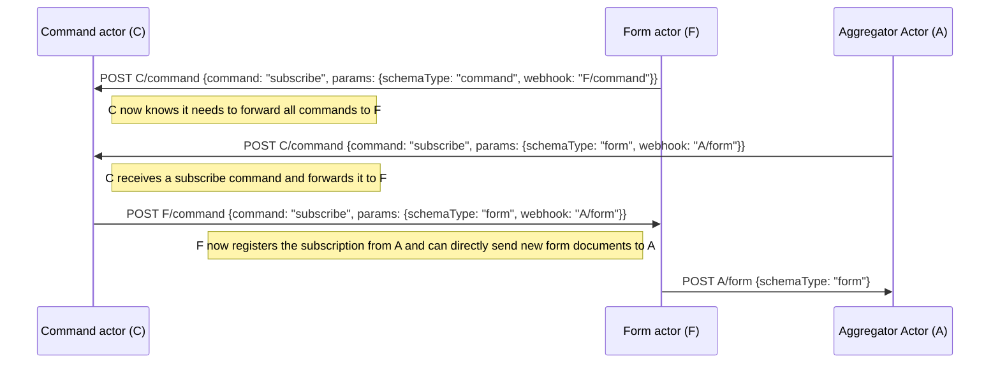
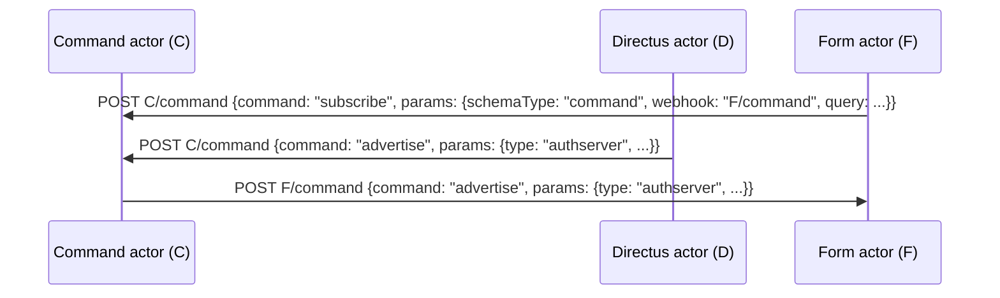

# description

Actor module, handling actor communication and subscriptions

to use as module in a project:

-   add local `.npmrc` file and supply your auth token:
-   add `.npmrc` to your `gitignore` file (never put auth tokens in version control)

```
//npm.pkg.github.com/:_authToken=[auth token]
registry=https://npm.pkg.github.com/propusit
```

-   npm install @propusit/module-actor

# usage

create a new actor and tell it where it is mounted

```typescript
const actor = new Actor({
    endpoint: `http://localhost:${port}${mountpoint}`,
});
```

then use in express server. Note: the express server should properly parse a json body using `body-parser`

```typescript
server.use(bodyParser.json());
server.use(mountpoint, actor.middleware);
```

# glossary

-   `document`: a JSON document sent between actors, having a particular `schemaType`
-   `schemaType`: an indicator field in a `document` that defines its type uniquely
-   `command`: a `document` of schemaType `command`

# schemaTypes available in this module (which can be used by all actors)

```typescript
export interface SchemaType extends Dict<any> {
    schemaType: string;
}

export interface Command<C extends string = string, P = Dict<any>>
    extends SchemaType {
    command: C;
    params: P;
    schemaType: "command";
    token: string;
    timestamp: number;
}

/** command to subscribe to a commands */
export type SubscribeCommand = Command<
    "subscribe",
    {
        webhook: string;
        schemaType: string;
        throttle?: number;
        maxSize?: number;
        hydrate?: boolean;
        query?: Dict<any>;
    }
>;

/** generic advertise command */
export type AdvertiseCommand<T extends string, P = Dict<any>> = Command<
    "advertise",
    { type: T } & {
        [key in keyof P]: P[key];
    }
>;

/** advertise as auth server */
export type AdvertiseAuthCommand = AdvertiseCommand<
    "authserver",
    {
        name: string;
        logintype: "credentials" | "oauth2"; //| 'sso';
        login: string;
        enroll?: string;
        callback?: string;
        logout: string;
        prompt: string;
    }
>;

/** advertise as data server */
export type AdvertiseDataCommand = AdvertiseCommand<
    "dataserver",
    {
        name: string;
        endpoints: {
            name: string;
            url: string;
        }[];
    }
>;
```

## `register`

registers a schemaType, give it a callback to handle incoming documents (for example to store them in a database). When the allowSubscibe flag is set, it allows incoming subscription commands to that schemaType (if the command handler is registered)

this registers a post endpoint on the middleware.
If the allowSubscribe flag is true, the documents are relayed to any subscribers
If an onIncoming handler is specified, it is called with the incoming documents

```js
actor.register("form", {
    onIncoming: (document) => {
        console.log("incoming form");
        // store locally
    },
    allowSubscribe: true, // also listen to incoming subscriptions on forms
});
```

-   the `onIncoming` handler receives incoming documents. This is where you do someting with them
-   the `webhook` flag is not used
-   the `persist` flag is not used
-   the `allowSubscribe` flag allows subscribers to receive copies of the incoming documents

## `registerCommandHandler`

registers the command handler. This creates an endpoint for commands and emits a `command` event when commands are received. It calls `register` under the hood. This is automatically called when an Actor is created.

## `on`

register an event listener. One such event is the "command" event as command documents come in

## `onCommand`

registers an event listener for "command" events

## `subscribe`

subscribe as a webhook to another actor by sending a `subscribe` command document using `sendCommand`. That other actor will send documents to own endpoints. If there is a command actor, there is no need to find out to which actor to subscribe, unless you have one in mind specifically, as the command actor will relay the subscription. Arguments:

-   `targetUrl`: url of the actor to subscribe to, typically the command actor, so `http://localhost:4001/actor`
-   `schemaType`: the schemaType you are interested in, typically commands, so `command`
-   `params`: optional subscription parameters:
    -   `hydrate`: boolean to tell the source you are interested in receiving already stored documents. The source may decide what to do with it
    -   `throttle`: throttle number for the source, may be used on hydrate
    -   `maxSize`: max size number for the source, may be used on hydrate
    -   `query`: any mingo query, only documents are sent that match the query
    -   `webhook`: webhook you want to receive documents on, defaults to `{mountpoint}/{schemaType}`

## `sendDocuments`

sends documents to the given target url

## `sendCommand`

sends a command document to the given target url

# Actor communication

All actors have endpoints for schematypes they can handle. Example is the Command Actor

A `POST` to `/actor/command` sends a command document to the server. Any actor may choose to persist these. In case of the Command Actor, it does not, as commands are ephemeral.

Any actor can implement a `/actor/command` endpoint if they wish, but that would require all actors to know of each others existence. This is the raison d'etre for the Command Actor.

Rather than hardcoding all actor endpoints, actors can send a `subscribe` command to the Command Actor. The `subscribe` command has the following interface:

```json
{
    "schemaType": "command",
    "command": "subscribe",
    "token": "--token--",
    "params": {
        "webhook": "url",
        "schemaType": "command",
        "throttle": 1,
        "maxSize": 1024,
        "hydrate": true,
        "query": {}
    }
}
```

Any command has a `command` field and `params` field. Params differ per command. In case of the `subscribe` command, it contains information about the subscription. Specifically, it contains a `webhook` url which gets called by the Command Actor when new commands arrive.

# typical scenario

We have 3 actors:

-   `C`: Command Actor: relaying commands
-   `F`: Form Actor: receiving evaluation forms through a user interface
-   `A`: Aggregator Actor: aggregating evaluation forms

## setup procedure

In the following `C/command` is short for a url like `http://commandActorInternalName/actor/command`



-   `F -> C` POST C/command: subscription to `command` schematypes on `C/command`, using the [`actor.subscribe`](#subscribe) method
-   `A -> C` POST C/command: subscription to `form` schematypes on `C/form`, using the [`actor.subscribe`](#subscribe) method
-   `C -> F` POST F/command: forward subscription of the `form` schematypes, since `F` is subscribed to all commands
-   `F -> A` POST A/form: Form Actor sends currently stored form documents matching query to Aggregator
-   `F -> A` POST A/form: when user creates a new form document, these are forwarded to the Aggregator

## advertisements

Another common command is the `advertise` command

In this case, the Forms actor subscribes to `command` documents with the command type `advertise` as the query, using the [`actor.subscribe`](#subscribe) method. The query may also contain other fields, for example:

```typescript
{
    command: "advertise",
    "params.type": "authserver",
    timestamp: { $gte: Date.now() - 10 * 1000 * 60 },
},
```

The forms actor repeats this subscription every 5 minutes for robustness

Any authentication actor (we have directus and auth0 at the moment) can advertise itself to the command actor using the [`actor.sendCommand`](#sendCommand) method, which the command actor then forwards to subscribers. This advertisement is repeated every 5 minutes



# other scenarios

## Actor is the command actor

The command actor is somewhat special, as it handles `command` schematypes. It acts as a central server and other actors may use this for discovery purposes if they don't have knowledge of the ecosystem.

Each actor automatically registers an endpoint for the `command` schematype.

The command actor also registers a subscription handler for the `command` schematype, meaning it responds to commands with the command `subscribe` for the schematype `command`. Most other actors typically do not do this

```typescript
actor.registerSubscriptionHandler("command");
```

In other words, actors can react to commands. A `subscribe` command is one such command, subscribing to documents of a particular schematype. In this case, the command actor handles subscriptions to new `command` documents.

In yet other words, this server reacts when other actors subscribe to `command` documents. It does so by relaying incoming commands to the webhook indicated by the subscription (if queries match). Also it may burst persisted commands if indicated by the remote actor

## Actor comes online

Any actor typically registers a schematype that the actor cares about. For example, the `form` actor registers a `form` schematype, meaning it can receive forms via a `/forms` endpoint. If indicated by the registration, the actor also starts listening to incoming `subscribe` commands for the schematype:

```typescript
actor.register("form", {
    onIncoming: (document) => {
        console.log("incoming form");
        // store locally
    },
    webhook: true,
    persist: false,
    allowSubscribe: true, // also listen to incoming subscriptions on forms
});
```

Listening to `subscribe` commands happens on the (automatically created) `/command` endpoint. These commands may be sent directly ("consiously") by remote actors if they know the endpoint url.

However, a more common scenario is that remote actors do not know the endpoint url, so the send the command to the command server, which relays it as described above.

In order to receive those commands, the actor needs to subscribe to them at the command server:

```typescript
actor.subscribe(commandServer, "command", {
    hydrate: true,
    query: { command: "subscribe", "params.schemaType": "form" },
});
```

## sending data to subscribers

Use the `relayToSubscriptions` method to send documents to all subscribers matching a particular schema type

# project setup

followed https://www.twilio.com/blog/2017/06/writing-a-node-module-in-typescript.html for project setup

# version history

## 1.2.0

-   extracted relayToAllSubscriptions method

## 1.1.0

-   added functional `hydrate` option to `registerSubscriptionHandler`. When this flag is set, the function is called on an incoming subscription. The function is expected to return an array of documents (possibly async) which are then sent to the subscriber.
-   extracted sendCommand method

## 1.0.0

-   initial release
